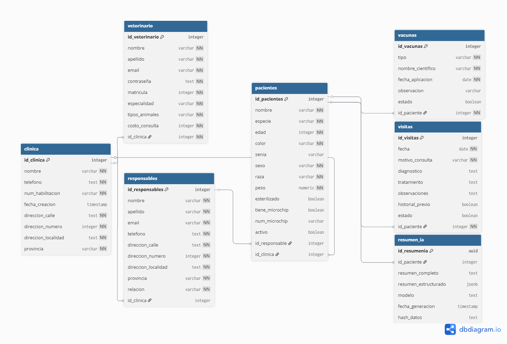

# Backend - Vetween Sistema de Gestión Veterinaria 🐾

Este servicio corresponde al **backend del sistema de gestión veterinaria**, encargado de manejar la lógica de negocio, autenticación de usuarios y comunicación con la base de datos.

La API permite gestionar clínicas, veterinarios, pacientes, responsables, visitas clínicas y vacunas, además de integrar un microservicio de inteligencia artificial para generar resúmenes automáticos de pacientes.

---

# Tecnologías utilizadas

- **Node.js**
- **Express.js**
- **Supabase (PostgreSQL)**
- **JWT** para autenticación
- **Bcrypt** para hasheo de contraseñas
- **Cripto** para encriptación de datos sensibles
- **Axios** para comunicación con microservicio de IA
- **Swagger** para documentación de la API

---

# Estructura del proyecto

```text
backend
│
├── src
│ ├── config        # Configuración de servicios externos (Supabase)
│ ├── controllers   # Manejo de requests y responses
│ ├── services      # Lógica de negocio
│ ├── routes        # Definición de endpoints
│ ├── middlewares   # Autenticación y validaciones
│ ├── models        # Definición de estructuras de datos
│ ├── schemas       # Validación de datos de entrada
│ └── utils         # Funciones auxiliares
│
├── docs            # Documentación y recursos (Swagger, DER)
├── server.js       # Punto de entrada del servidor
├── package.json
└── README.md
```

---

# Requisitos previos

Antes de ejecutar el proyecto es necesario tener instalado:

- Node.js (v18 o superior)
- npm
- Cuenta en Supabase
- Variables de entorno configuradas

---

# Instalación del proyecto

1. Clonar el repositorio

```bash
git clone <url-del-repositorio>
```

2. Entrar en la carpeta del backend

```bash
cd apps/backend
```

3. Instalar dependencias

```bash
npm install
```

---

# Variables de entorno

Crear un archivo `.env` en la raíz de la carpeta `backend`.

Ejemplo:

```env
PORT=3000
SUPABASE_URL=tu_url_supabase
SUPABASE_SERVICE_ROLE_KEY=tu_supabase_service_role_key
JWT_SECRET=tu_jwt_secret
AI_URL=http://localhost:5001
ENCRYPTION_KEY="tuclavede32caracteres1234567890a"
CORS_ORIGIN=https://localhost:8040
```

Estas variables permiten conectar el backend con la base de datos y el microservicio de inteligencia artificial.

---

# Configuración de base de datos

La base de datos se encuentra implementada en **Supabase**, utilizando PostgreSQL.

El modelo de datos incluye las siguientes entidades principales:

- clinica
- pacientes
- responsables
- resumen_ia
- vacunas
- veterinario
- visitas


Las relaciones permiten:

- registrar veterinario y clínica
- autenticar un veterinario registrado
- registrar un responsable
- registrar paciente asociado a un responsable ya registrado
- registrar visita clínica
- registrar vacuna
- generar resumen clínico mediante IA

Este modelo fue diseñado a partir de los requerimientos funcionales del sistema.

---

# Ejecutar el servidor

Modo desarrollo local

- Para ejecutar el backend en tu máquina local:

```bash
npm run dev
```

El servidor quedará disponible en:

```text
http://localhost:3000
```

Modo testing (Render)

- El backend también se encuentra desplegado en un entorno de pruebas en Render:

```text
https://backend-vetween.onrender.com
```

Los cambios se actualizan automáticamente al hacer push a la rama correspondiente.

---

# Documentación de la API

La documentación de endpoints está disponible mediante **Swagger**.

Una vez iniciado el servidor se puede acceder en:
https://backend-vetween.onrender.com/api-docs 


Desde allí es posible:

- visualizar todos los endpoints
- ver los parámetros requeridos
- probar las solicitudes directamente

---

## Modelo de datos (DER)

El sistema utiliza una base de datos relacional en PostgreSQL (Supabase).
El siguiente diagrama muestra las entidades principales y sus relaciones.



---

# Funcionalidades principales de la API

La API permite gestionar:

### Autenticación

- registro de clínicas y veterinarios
- login con generación de token de acceso

### Gestión de responsables

- registro de responsables
- consulta de todos los responsables
- consulta de un responsable por ID
- actualización de responsables
- eliminación de un responsable por ID

### Gestión de clínicas

- consulta de clínicas
- actualización de clínicas

### Gestión de pacientes

- registro de pacientes
- consulta de todos los pacientes
- consulta de un paciente por ID
- actualización de pacientes
- eliminación de un paciente por ID

### Gestión de veterinarios

- consulta de veterinarios
- actualización de veterinarios

### Gestión de visitas

- registro de visitas clínicas
- consulta del historial de visitas
- inactivación de una visita

### Gestión de vacunas

- registro de vacunas
- consulta de vacunas por ID de paciente
- inactivación de una vacuna

### Inteligencia Artificial

El sistema se integra con un microservicio de IA que permite:

- generar **resúmenes clínicos automáticos**
- consultar resúmenes generados por paciente

---

# Arquitectura del backend

El backend sigue una arquitectura por capas:

Routes → Controllers → Services → Database


**Routes**

Definen los endpoints de la API.

**Controllers**

Reciben la request, validan los datos y delegan la lógica al service correspondiente.

**Services**

Contienen la lógica de negocio y la comunicación con la base de datos.

**Database**

Persistencia de datos utilizando Supabase (PostgreSQL).

---

# Estado del proyecto

El backend se encuentra en una versión funcional (**MVP**) que implementa las principales funcionalidades del sistema de gestión veterinaria, incluyendo autenticación, gestión de clínicas, veterinarios, pacientes, responsables, visitas, vacunas y generación de resúmenes clínicos mediante IA.

---

# Autoría

Proyecto desarrollado por el equipo de backend como parte del entrenamiento de Igrowker ISA.